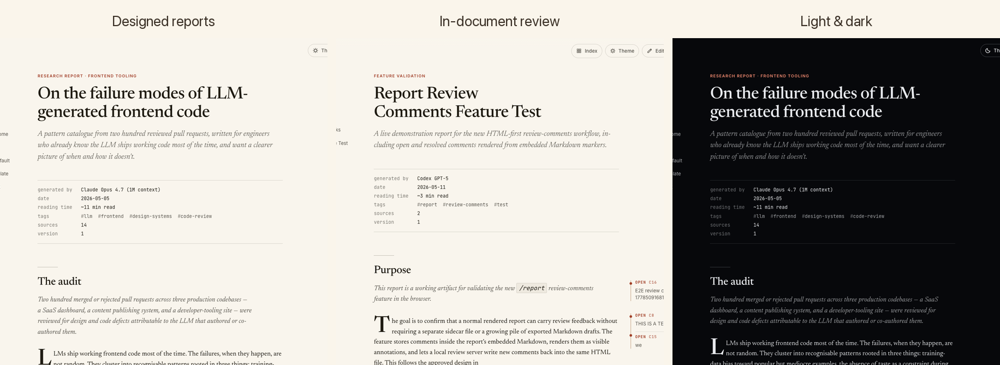
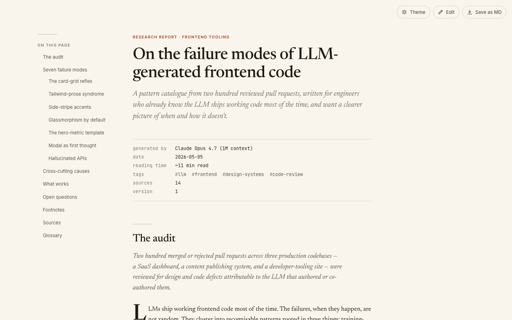
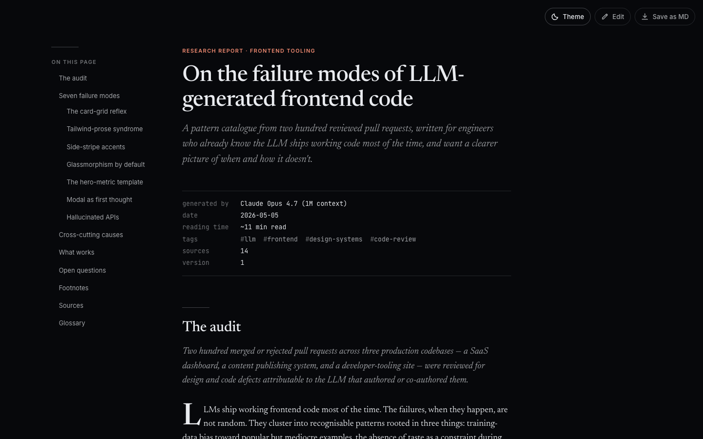
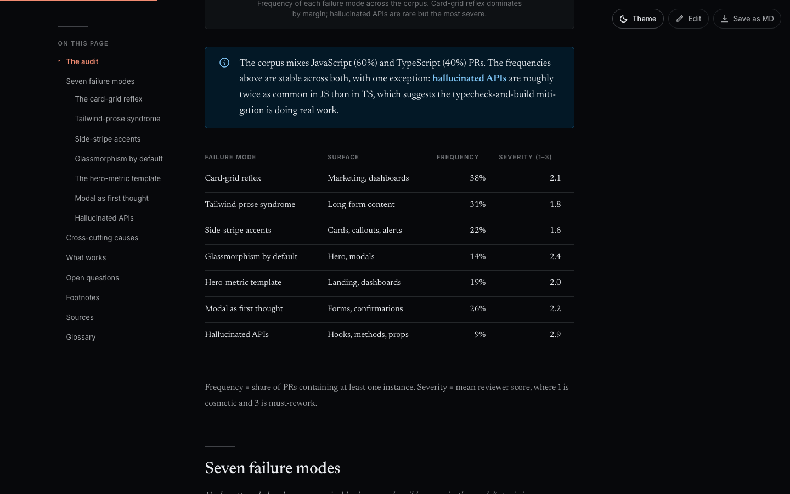
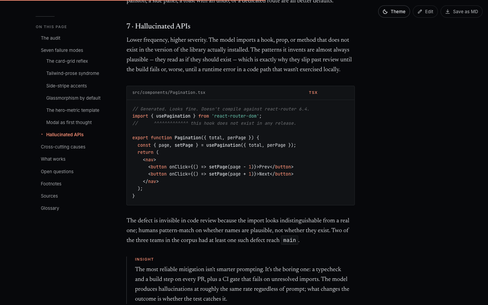
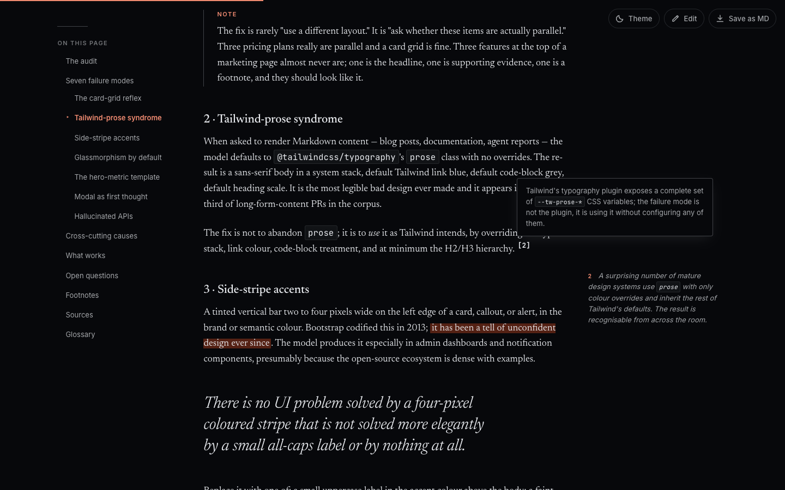
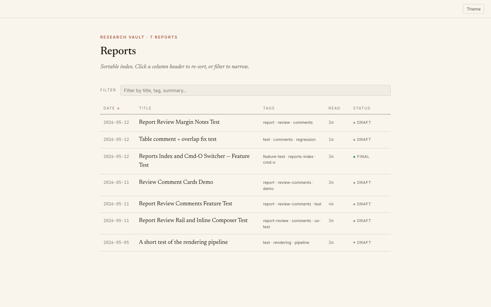
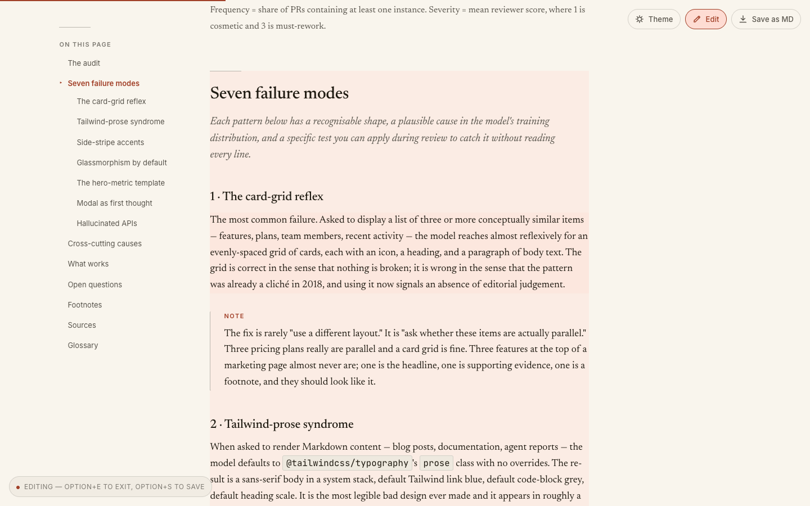
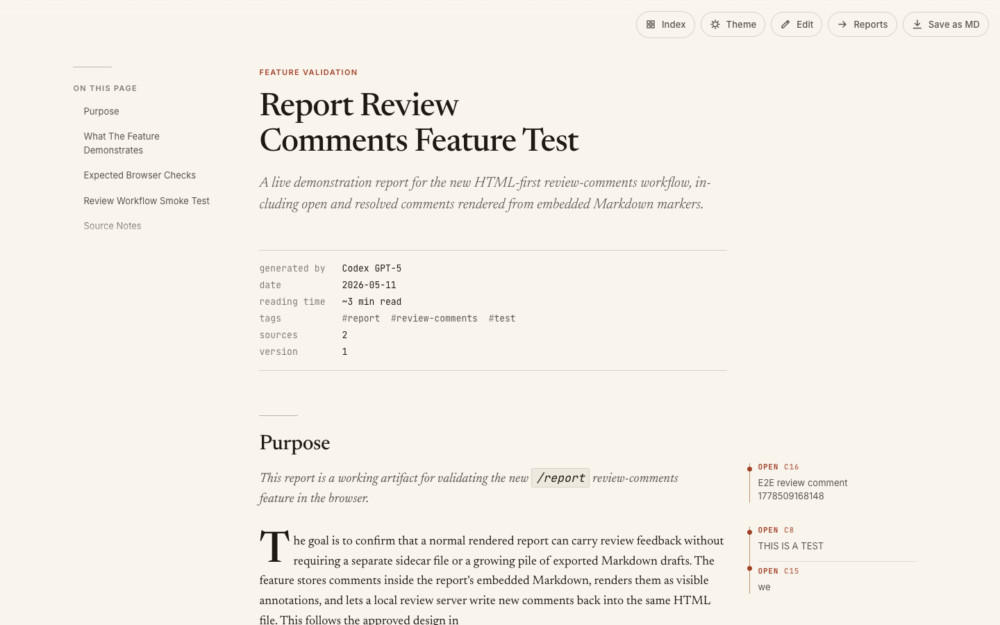
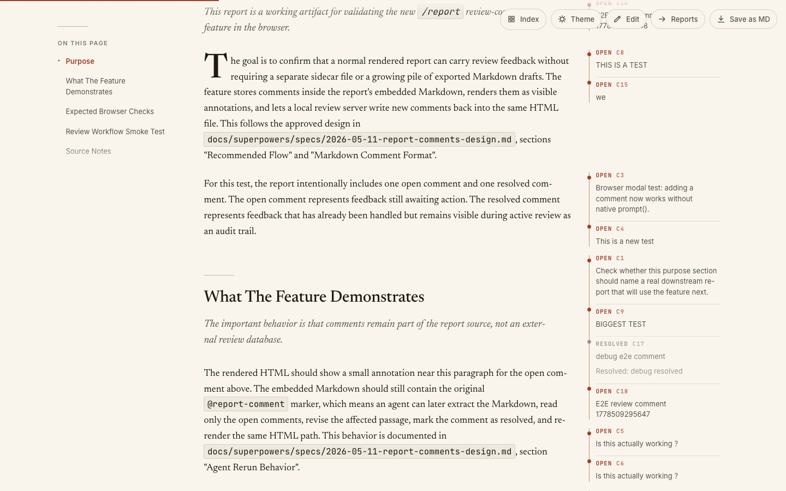

# Report Skill

> A [Claude Code](https://claude.com/claude-code) skill that turns long-form agent output — research, deep-dives, postmortems, analyses, write-ups — into a **designed HTML document** instead of another flat `.md` file.

The agent writes plain Markdown. `render.mjs` does everything else: serif typography, light/dark theme, sticky table of contents, syntax-highlighted code, callouts, framed figures with click-to-zoom, hover-preview footnotes, in-browser comments, and one-click export back to source Markdown.

Token spend is identical to writing a plain `.md`. The HTML is generated mechanically.



**See an example:** **[report-skill.vercel.app](https://report-skill.vercel.app/)** — a fully rendered report, theme-switchable, openable right now.

The renderer is plain Node and runs against any Markdown — whatever agent (or human) wrote it. The Claude Code plugin is the optional auto-trigger surface; rendering itself is editor- and agent-agnostic. And because review threads are persisted inside the embedded source, an agent can read its own comment feedback and revise the report against it.

---

## The moment this matters

You asked Claude to *"research the failure modes of LLM-generated frontend code"*, or *"postmortem the outage from last Thursday"*, or *"document our auth migration so the team can review it"*. Three minutes later you have **3,000 words of genuinely good output** sitting in a `.md` file. And then what?

You open it in your editor. The wall of plain text doesn't feel like the work it is. You can't send it to a colleague without context. You can't comment on it block-by-block. You can't even tell at a glance which sections are long. The artifact undersells the work.

This skill is for that moment. The agent writes the same Markdown it would have anyway. The renderer turns it into a document — TOC on the side, theme that respects the time of day, footnotes that pop out on hover, tables that look like tables, comments you can leave on any paragraph. The same words; a wholly different artifact.

The point isn't fancier output. It's making the artifact **good enough to share** — with a teammate, a client, or future-you — without a separate publishing step.

## Features

- **Light & dark themes** with a single toggle. Stored in `localStorage`, respects `prefers-color-scheme` on first load.
- **Sticky table of contents** built from your headings, with scrollspy highlighting the current section.
- **Hero metadata block** — generated by, date, reading time, tags, sources, version — pulled from YAML frontmatter.
- **Custom Markdown extensions** — info / warning / success callouts, framed figures, captioned images, key-value bento boxes, source citations.
- **Hover-preview footnotes** — references show the footnote text in a side popover without losing your place.
- **Syntax-highlighted code blocks** for the languages you actually use.
- **Save as Markdown** — the source `.md` is embedded in the HTML; one button extracts it back out. The HTML is the canonical artifact; the source survives inside it.
- **Inline edit mode** — toggle to fix typos directly in the browser, then save the corrected source back to disk.
- **Comments & review** — drop margin notes on any block during a local review session; comments are persisted as `@report-comment` markers inside the embedded Markdown and survive re-renders.
- **Sortable, filterable report index** — `build-index.mjs` scans `reports/` and renders a real index page with status pills, tags, and reading time.

### Hero — light & dark

| Light | Dark |
|---|---|
|  |  |

The same document, the same typography. Theme toggle lives top-right. Both modes target long-form reading: warm off-white / near-black backgrounds, serif body, generous measure, no glow.

### Callouts, tables, and the rest of the prose toolkit



Callouts (`> [!info]`, `> [!warning]`, `> [!success]`), real data tables with right-aligned numerics, drop caps on section openers, and a hairline rule between sections. Everything has a place; nothing has a glow.

### Syntax-highlighted code



Fenced code blocks render with proper language highlighting. The file name above the block is optional — add it via the code-fence info string.

### Hover-preview footnotes



Standard Markdown footnote syntax (`[^1]`). On hover, the footnote pops out in the side margin instead of yanking you to the bottom of the page. Tap on mobile.

### Sortable, filterable report index



`build-index.mjs` walks `reports/`, reads each report's frontmatter, and produces a real index page. Click a column header to sort. Type in the filter to narrow by title, tag, or summary. Status pills (`draft` / `final`) come from frontmatter.

### Inline edit mode



Click **Edit** in the top-right (or press `Option+E`) and the body of the report becomes `contenteditable`. Hovering a block lightly tints it; clicking it puts the caret inside. A status pill anchors at the bottom-left while edit mode is on (*"Editing — Option+E to exit, Option+S to save"*).

**How it works:**

1. The toggle flips `data-edit-mode="true"` on `<body>`. CSS turns headings, paragraphs, list items, table cells, blockquotes, and code blocks into edit targets and hides chrome that shouldn't be touched (heading anchors, copy-code buttons, footnote back-links).
2. You type your fix straight into the page.
3. Press `Option+S` (or click **Save as MD**) and the page rebuilds the source Markdown from the DOM and pushes it back to disk. The original `.md` file next to the HTML is updated, and `render.mjs` is re-run automatically so the visible HTML and embedded `source-md` stay in sync.

This is the path for typo-level fixes and small wording changes — anywhere you'd otherwise stop, open the source `.md`, edit, and re-render. For larger structural changes, edit the `.md` directly and re-render with `node render.mjs`; the workflows compose.

Markdown is still the source of truth. Edit-mode only round-trips through it — there's no separate "edited HTML" artifact to keep track of.

### Comments & review



Long-form reports need review just like code does. The skill ships a local review server that turns any rendered HTML into a commentable surface — without a separate database, account system, or hosted service.

**Start a review session** against any rendered report:

```bash
node ~/.claude/skills/report/review.mjs reports/the-report.html
```

The server prints a `localhost` URL. Open it; the report now has comment chrome on top of the regular reading view.

**Add a comment:** press `C` (or click **Comment**) to enter comment mode, then click any block — paragraph, heading, list item, code block, figure caption. A composer opens, you type, `Cmd+Enter` to save. The comment appears in the right-side rail with a status (`open` / `resolved`), an ID (`c8`, `c15`, …), and a backlink to its target block.



**Manage threads from the rail.** Click a comment to focus it — the card expands with **edit**, **resolve**, **reopen**, and **delete** actions. The rail shows open / resolved / total counts and a status filter. Press `N` to jump to the next open comment.

**Deep-link anywhere.** Every comment and every block has a stable ID (`#comment-cN`, `#block-bN`) so you can paste a link to a specific thread or paragraph into a chat, ticket, or another report.

**How comments survive re-renders.** This is the part that makes the system durable:

- The review server stores comments as HTML markers inside the embedded `<script id="source-md" type="text/markdown">` block:
  ```html
  <!-- @report-comment id="c8" status="open" target="block:b14"
  THIS IS A TEST
  -->
  ```
- Every comment write updates **both** the HTML's embedded `source-md` **and** the sibling `.md` file next to it. The source `.md` is the canonical artifact; the HTML embed is a mirror.
- When the agent (or you) re-renders with `node render.mjs the-report.md`, comments come back along with the prose. They are part of the document.
- An agent rerunning a revision pass reads the `.md`, sees every `@report-comment` marker with its target block, edits the affected text, and changes each handled marker from `status="open"` to `status="resolved"` with a `Resolved: …` paragraph appended.

**Export a Markdown review summary** when you want a quick-scan list of all threads:

```bash
node ~/.claude/skills/report/review-summary.mjs reports/the-report.html
```

**Strip comments when the report is final:**

```bash
node ~/.claude/skills/report/clean-comments.mjs reports/the-report.html
```

The point of the design: review is part of the artifact, not an external system. Send the HTML to someone, they comment, send it back — the comments come along inside the same file.

---

## Cost — vs. writing plain Markdown

The honest comparison, since the skill replaces a `.md` file with an HTML one.

| | Plain `.md` | Rendered report |
|---|---|---|
| **Tokens the agent writes** | Markdown | Markdown — *identical* |
| **Disk size** | ~5–15 KB | ~100–150 KB (template + content) |
| **Render time** | none | ~200–400 ms per report |
| **Dependencies** | none | Node.js 20+ |
| **What you open** | a text file | a designed document |
| **Editable later** | yes — re-open the `.md` | yes — `.md` is preserved next to the HTML, *and* embedded inside it |
| **Round-trippable** | trivially | yes — `extract.mjs` recovers source from any HTML |
| **Review workflow** | comments-in-a-separate-file or PR review | first-class, in-document, persisted into the source |

**The token cost is zero.** The agent writes the same Markdown it would have written for a `.md` file — there is no "render this richer" prompt that costs more output tokens. The HTML is built mechanically from the Markdown by `render.mjs`, which doesn't talk to a model.

**The disk cost is real but bounded.** A rendered report is ~10× larger than its source Markdown because the entire template — CSS, fonts as CSS variables, theme switcher, TOC builder, lightbox, edit mode, comment rail, syntax highlighting — is inlined into every file. That's a deliberate trade: each HTML is a self-contained artifact you can email, drop into a Slack channel, or open offline ten years from now without a build step. No `node_modules`, no CDN, no broken links.

**The dependency cost is one binary.** Node 20+ for `render.mjs`. No npm install, no bundler, no framework. The renderer is plain `.mjs`.

**When to skip this skill and just write Markdown:** quick conversational answers, single-file code edits, status updates, one-line confirmations, anything under ~300 words. The skill is for *real* reports — write-ups you'd want to come back to, not every paragraph an agent emits.

---

## Quick start (no Claude Code required)

The renderer is plain Node 20+, zero npm dependencies. It works against any Markdown:

```bash
git clone --depth 1 https://github.com/TheoRata/Report-Skill.git
node Report-Skill/skills/report/render.mjs your-doc.md
```

Open the resulting `your-doc-YYYY-MM-DD.html` in any browser. That's the entire standalone install path — drop the command into a Cursor / Aider / Codex / raw-API workflow and the renderer doesn't care which agent (or human) produced the input.

If you use Claude Code, you can also install the skill as a plugin so it triggers automatically from prompts like "deep-dive on X" or "postmortem Y" — see below.

## Install

### Option 1 — Claude Code plugin (recommended)

From inside Claude Code:

```
/plugin marketplace add TheoRata/Report-Skill
/plugin install report@report-skill
```

That's it. Restart the session and the skill is live globally.

To update later: `/plugin marketplace update report-skill`. To uninstall: `/plugin uninstall report@report-skill`.

### Option 2 — Direct clone

If you'd rather skip the plugin manager, clone the `skills/report/` subdirectory into Claude Code's skills directory:

```bash
git clone --depth 1 https://github.com/TheoRata/Report-Skill.git /tmp/report-skill && \
  cp -R /tmp/report-skill/skills/report ~/.claude/skills/report && \
  rm -rf /tmp/report-skill
```

That makes `/report` available globally across all your Claude Code projects. To install per-project instead, copy into `<project>/.claude/skills/report/`.

## Use

Just ask. Claude picks up the skill from the description:

- *"Write me a deep-dive on X."*
- *"Postmortem the Y incident."*
- *"Document the Z system."*
- *"Research X and give me your findings."*
- *"Investigate X and write it up."*

Or invoke directly with `/report`.

The skill writes Markdown to `reports/<slug>-<date>.md`, runs the renderer, and tells you the file path to open. To edit an existing report, ask Claude to update it — it edits the source Markdown in place and re-renders.

### Manual render

```bash
node ~/.claude/skills/report/render.mjs reports/my-report.md
# → reports/my-report-2026-05-16.html
```

### Index page

```bash
node ~/.claude/skills/report/build-index.mjs reports/
# → reports/index.html + reports/index.json
```

### Extract Markdown from a rendered HTML

```bash
node ~/.claude/skills/report/extract.mjs reports/my-report-2026-05-16.html
# → reports/my-report-2026-05-16.md (round-trips cleanly)
```

## Markdown extensions

Frontmatter (required):

```yaml
---
title: On the failure modes of LLM-generated frontend code
subtitle: A pattern catalogue from two hundred reviewed pull requests
kicker: Research report · Frontend tooling
date: 2026-05-05
tags: [llm, frontend, design-systems, code-review]
status: final         # draft | final
reading_time: 11      # minutes; auto-computed if omitted
generated_by: Claude Opus 4.7 (1M context)
sources: 14
version: 1
---
```

Callouts:

```markdown
> [!info]
> The corpus mixes JavaScript (60%) and TypeScript (40%) PRs.

> [!warning]
> The accessibility regression here is thin: backdrop-blurred surfaces over
> photographs routinely fail 4.5:1 contrast.

> [!success]
> Typecheck-and-build mitigation halves hallucinated APIs at near-zero cost.
```

Framed figures:

```markdown

{.figure-frame caption="Card-grid reflex dominates by margin."}
```

Footnotes:

```markdown
Card grids look uniform whether the items are parallel or not.[^1]

[^1]: This is the failure mode I see most often in review.
```

Source citations:

```markdown
::: sources
1. Internal corpus, three production codebases, 200 PRs reviewed Q1–Q2 2026.
2. Lupton, E. *Thinking with Type*, 2nd ed., Princeton Architectural Press.
:::
```

See [SKILL.md](skills/report/SKILL.md) for the complete list — bento metadata blocks, key-value definition lists, glossary sections, and more.

## What's in here

The skill itself lives under [`skills/report/`](skills/report/). The repo root holds the plugin manifests, this README, the screenshots, and the recording script.

| File (in `skills/report/`) | Purpose |
|---|---|
| [`SKILL.md`](skills/report/SKILL.md) | Skill entry point — read by Claude Code when `/report` is invoked |
| `render.mjs` | Markdown → HTML renderer (the workhorse) |
| `template.html` | The HTML shell the renderer fills in |
| `index-template.html` | Template for the `reports/` index page |
| `build-index.mjs` | Builds the index of all reports in a project |
| `extract.mjs` | Pulls source Markdown back out of a rendered HTML report |
| `comments.mjs` / `clean-comments.mjs` | In-browser comment popup system |
| `review.mjs` / `review-summary.mjs` | Review-mode helpers (rail, Cmd-O switcher) |
| `example.html` | A rendered sample so you can see the output |
| `*.test.mjs` | Node `--test` suite |

## Tests

```bash
cd ~/.claude/skills/report
node --test *.test.mjs
```

## License

MIT — use it, fork it, improve it. PRs welcome.
